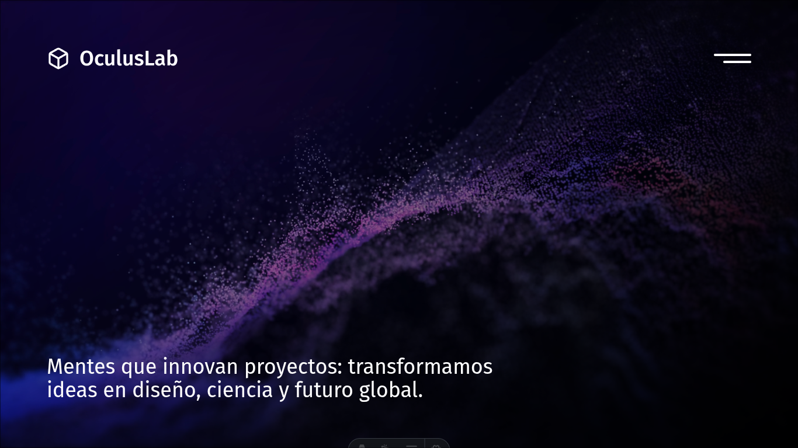

# OculusLab Web



## 🔬 Sobre OculusLab

**OculusLab** es un equipo de investigación de vanguardia dedicado a la exploración, análisis y desarrollo de soluciones tecnológicas innovadoras. Este repositorio aloja el código fuente de nuestra plataforma web oficial, diseñada para servir como punto de encuentro para nuestros hallazgos, publicaciones científicas y proyectos en desarrollo.

## 🚀 Visión General del Proyecto

Esta plataforma web ha sido construida con un enfoque en el **rendimiento**, la **accesibilidad** y la **experiencia de usuario**. Utilizamos una arquitectura moderna que garantiza tiempos de carga rápidos y una navegación fluida, reflejando la excelencia técnica que caracteriza a nuestro equipo de investigación.

### 🛠️ Stack Tecnológico

El proyecto aprovecha las últimas herramientas del ecosistema web para ofrecer una experiencia de desarrollo y usuario superior:

- **[Astro 5](https://astro.build/):** El núcleo de nuestra arquitectura. Un framework web diseñado para la velocidad, que nos permite entregar menos JavaScript al cliente y renderizar contenido estático de manera eficiente.
- **[Tailwind CSS 4](https://tailwindcss.com/):** Utilizado para el diseño de la interfaz. Nos permite construir componentes visuales modernos y totalmente responsivos directamente en el marcado, con un sistema de diseño coherente.
- **[Lucide Astro](https://lucide.dev/):** Implementación de iconos vectoriales SVG limpios y ligeros para mejorar la interfaz de usuario.
- **[Vite](https://vitejs.dev/):** El motor que impulsa nuestro entorno de desarrollo y proceso de construcción, garantizando recargas instantáneas y builds optimizados.

### 🏗️ Arquitectura del Proyecto

La estructura del código sigue una organización modular y escalable, típica de los proyectos Astro:

```text
/
├── public/          # Archivos estáticos públicos (imágenes, fuentes, etc.)
├── src/
│   ├── assets/      # Activos procesados por Vite (imágenes optimizadas)
│   ├── components/  # Componentes de UI reutilizables y modulares
│   ├── layouts/     # Plantillas maestras que definen la estructura común de las páginas
│   ├── pages/       # Rutas de la aplicación (File-based routing)
│   └── styles/      # Estilos globales y configuraciones de CSS
├── astro.config.mjs # Configuración del framework Astro
└── package.json     # Definición de dependencias y scripts
```

## 💻 Guía de Inicio

Sigue estos pasos para configurar el entorno de desarrollo localmente:

1. **Clonar el repositorio**
   ```bash
   git clone https://github.com/Oculus-Lab/oculus-lab-web.git
   cd oculus-lab-web
   ```

2. **Instalar dependencias**
   ```bash
   npm install
   ```

3. **Ejecutar en modo desarrollo**
   ```bash
   npm run dev
   ```
   La aplicación estará disponible en `http://localhost:4321`.

4. **Construir para producción**
   ```bash
   npm run build
   ```

---

<p align="center">
  © 2025 <strong>OculusLab</strong>. Todos los derechos reservados.
</p>
